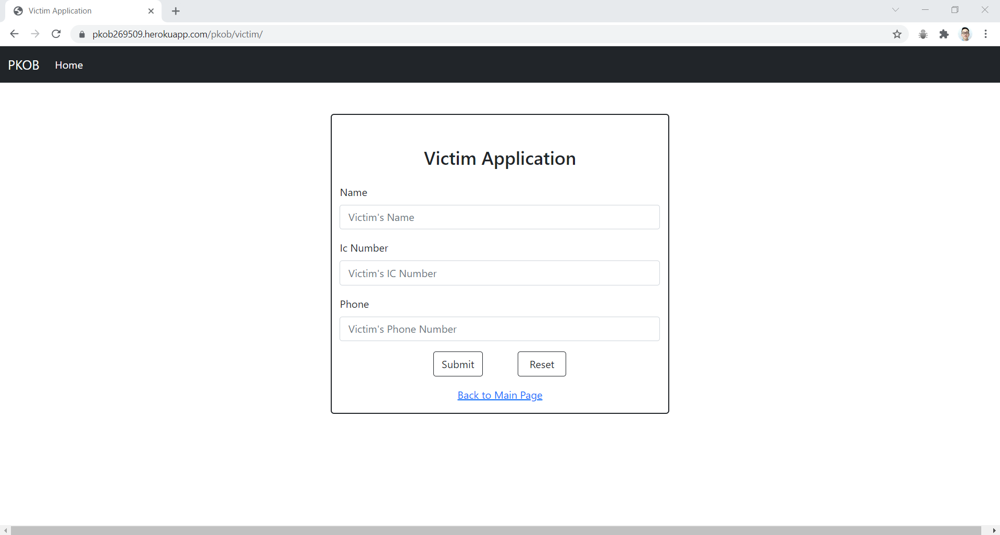

## STIW3054-RealTimeProgramming-Assignment1

## Requirements for Assignment-1
[Read the instruction](https://github.com/STIW3054-A211/e-sulam/blob/main/Assignment-1.md)

## Your Info:
|                 Name                  | Matric No |  Phone Number   |                   Image                   |
| :-----------------------------------: | :-------: | :-------------: | :---------------------------------------: |
| Tan Jia Earn                          |  269509   | +60174422928    |         |

## Introduction

This assignment is about the web application of Pusat Kawalan Operasi Bencana (PKOB). In this assignment, PKOB provides users with 3 services, namely, adding a new victim, viewing the victim list, and editing victim details. After the user chooses the add feature, a form will appear, and the user needs to fill in all the text fields to add a new victim. After clicking submit, the data will be stored in the Sqlite database. The user can also view the list of victims. In the list, the user can click the "Edit" button to enter the "victim details" page. On the "victim details" page, users can only edit phone numbers.
 

## Result/Output (Screenshot of the output)

Home

 

Add

List

Edit

## Youtube Presentation

Youtube Link: https://youtu.be/GM_md2xcBy4

## Heroku Link

Hekoku Link: https://pkob269509.herokuapp.com/

## List of Python packages (including the version) used for this system
| Package    |   Version  |
| :--------: | :--------: | 
| Django     |    3.2.8   |
| asgiref    |    3.4.1   |
| pip        |    21.1.2  |
| pytz       |    2021.3  |
| setuptools |    57.0.0  |
| sqlparse   |    0.4.2   |
| wheel      |    0.36.2  |
| gunicorn   |    20.1.0  |

## References (Not less than 10)

1. <i>Get local timezone in django.</i> (2013, February 2). Stack Overflow. https://stackoverflow.com/questions/14657173/get-local-timezone-in-django

2. <i>Asia/Kuala_Lumpur: Time Zone in Malaysia, Current local time.</i> (n.d.). Time Difference. https://www.zeitverschiebung.net/en/timezone/asia--kuala_lumpur

3. <i>HTML input readonly Attribute.</i> (n.d.). W3schools. https://www.w3schools.com/tags/att_input_readonly.asp

4. <i> How to get the first 2 letters of a string in Python?</i>  (2014, January 8). Stack Overflow. https://stackoverflow.com/questions/20988835/how-to-get-the-first-2-letters-of-a-string-in-python

5. <i>How to: Print the last two digits of the year.</i> (n.d.). Kite. https://www.kite.com/python/examples/1815/time-print-the-last-two-digits-of-the-year

6. <i>How do I calculate age from the last two digits of the current year and birth year?</i> (2020, July 3). Quora. https://www.quora.com/How-do-I-calculate-age-from-the-last-two-digits-of-the-current-year-and-birth-year 

7. <i>Bootstrap Icons.</i> (n.d.). Bootstrap. https://icons.getbootstrap.com/

8. <i>Bootstrap Cursor -- Tutorials with advanced examples.</i> (n.d.). Torus Kit. https://toruskit.com/docs/utilities/cursor/

9. <i>queries | Django documentation | Django.</i>  (n.d.). Django Project. https://docs.djangoproject.com/en/3.2/topics/db/queries/

10. <i>dev.yakuza@gmail.com.</i>  (2020, December 16). django Form. Dev-Yakuza. https://dev-yakuza.posstree.com/en/django/form/

11. <i>Model instance reference | Django documentation | Django.</i>  (n.d.). Djangop Project. https://docs.djangoproject.com/en/dev/ref/models/instances/#saving-objects

12. <i>Deploying with Git | Heroku Dev Center.</i>  (n.d.). Heroku. https://devcenter.heroku.com/articles/git
